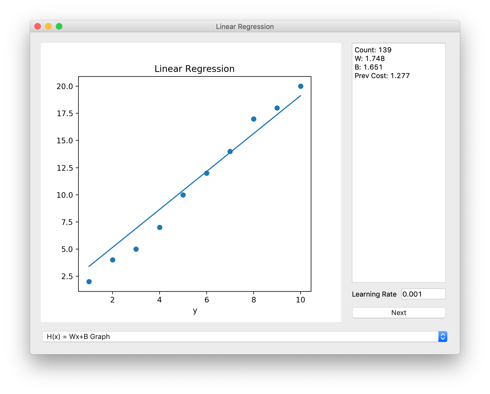
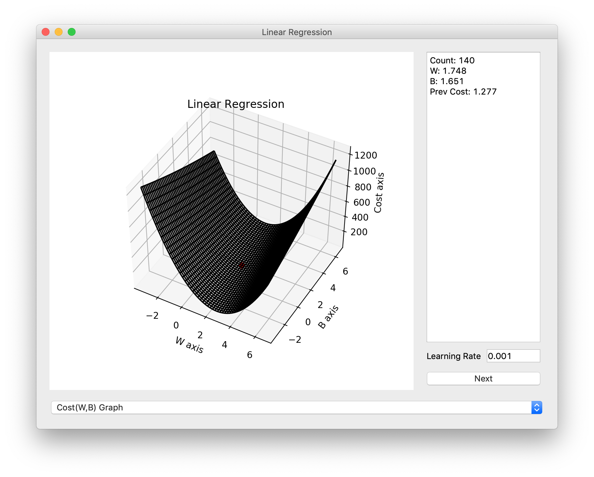
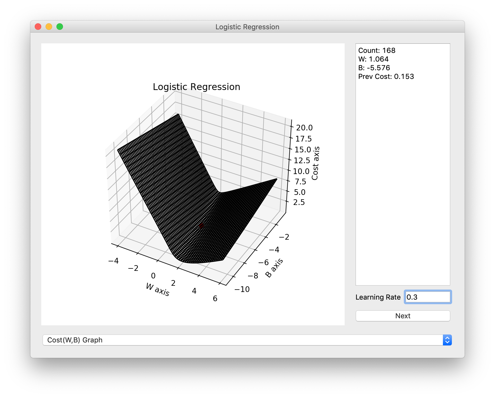

# LearnAI

## You only need to Control Parameters and Code your Cost Function

### You must install modules below
  ```
  pip install PyQt5
  pip install numpy
  pip install matplotlib
  ```

------------------------
### Available Modules and Samples

1. Linear Regression



2. Logistic Regression



3. Logistic Classification
