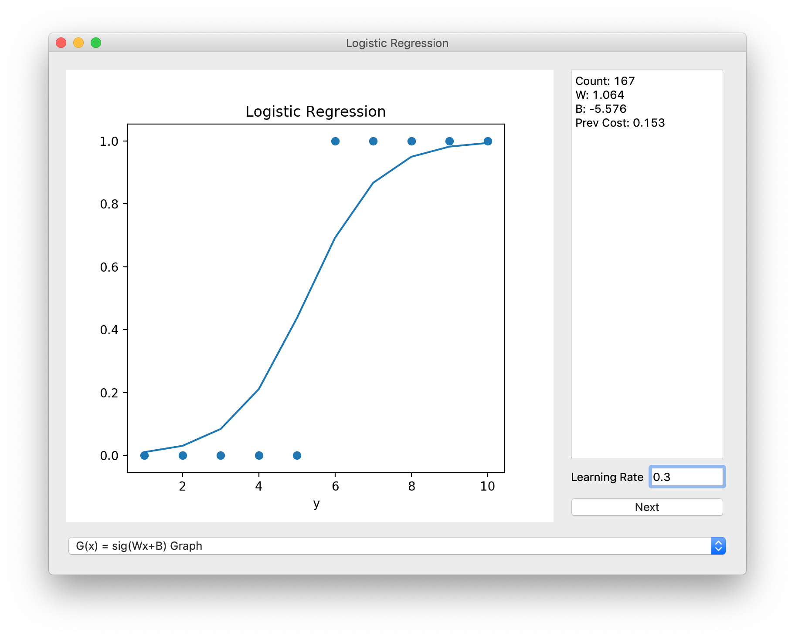
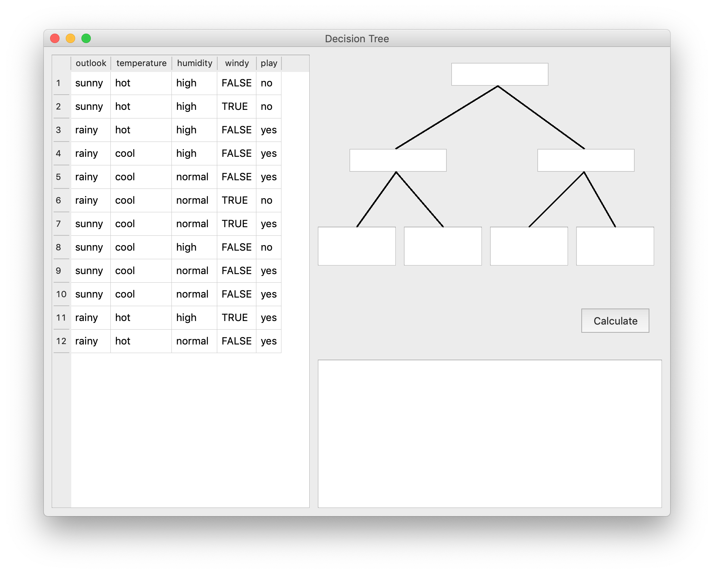

# LearnAI

## You only need to Control Parameters and Code your Cost Function

### You must install modules below
  ```
  pip install PyQt5         # User Interface Tool
  pip install numpy         # Mathematical Tool
  pip install matplotlib    # Graph Visualization Tool
  ```

------------------------
### Available Modules and Samples

1. Linear Regression


2. Logistic Regression



3. Decision Tree

